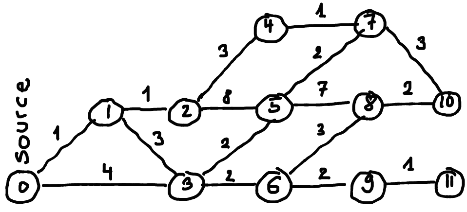

.. tryalgo documentation master file, created by
   sphinx-quickstart on Sat Nov  7 13:03:23 2015.
   You can adapt this file completely to your liking, but it should at least
   contain the root `toctree` directive.

Welcome to tryalgo's documentation!
===================================

This Python library implements various algorithms and data structures such as graph, string and computational geometry problems.

Proofs of correctness of these algorithms are available in the French language book: `Programmation efficace : les 128 algorithmes qu'il faut avoir compris et codés en Python au cours de sa vie <http://www.editions-ellipses.fr/product_info.php?products_id=10829>`_.

.. toctree::
   :maxdepth: 2

   content

* :ref:`modindex`
* :ref:`genindex`
* `GitHub Project <https://github.com/jilljenn/tryalgo>`_

Installation
------------

With PIP
::::::::

You can install the tryalgo package using pip: ::

    $ pip3 install tryalgo

From PyPI
:::::::::

Download the `tar.gz file from PyPI <https://pypi.python.org/pypi/tryalgo/>`_ and extract it.  The library consists of a directory named `tryalgo` containing several Python modules.

First steps
-----------

Coin change
:::::::::::

Here is an dynamic programming example, with coin change (`6 lines of source code <http://pythonhosted.org/tryalgo/_modules/tryalgo/subsetsum.html#coin_change>`__): ::

    #!/usr/bin/env python3

    from tryalgo import coin_change

    print(coin_change([3, 5, 11], 29))

Which should print :code:`True` because 29 can be expressed as the linear combination 6*3 + 0*5 + 1*11.

Longest palindrome substring of a string
::::::::::::::::::::::::::::::::::::::::

In order to find the longest palindrome substring of a string, you can use the implementation of Manacher's algorithm (`source <http://pythonhosted.org/tryalgo/_modules/tryalgo/manacher.html#manacher>`__) as follows: ::

    from tryalgo import manacher
    print(manacher("babcbabcbaccba"))

which will print (1,10). Indeed, the substring from index 1 to index 10 (excluding position 10) is the palindrome "abcbabcba".

Pathfinding
:::::::::::

Now, suppose you want to compute the shortest paths in the following graph starting at vertex 0.

First, we need to encode this graph with a an adjacency list data structure :code:`graph`, which format we call *listlist*, where :code:`graph[u]` is the list of neighbors of vertex :code:`u`.  The edge weights are simply encoded in a squared matrix: ::

    graph = [[1, 3],
             [0, 2, 3],
             [1, 4, 5],
             [0, 1, 5, 6],
             [2, 7],
             [2, 3, 7, 8],
             [3, 8, 9],
             [4, 5, 10],
             [5, 6, 10],
             [6, 11],
             [7, 8],
             [9]]

    _ = None
    #           0  1  2  3  4  5  6  7  8  9 10 11
    weights = [[_, 1, _, 4, _, _, _, _, _, _, _, _], # 0
               [1, _, 1, 3, _, _, _, _, _, _, _, _], # 1
               [_, 1, _, _, 3, 8, _, _, _, _, _, _], # 2
               [4, 3, _, _, _, 2, 2, _, _, _, _, _], # 3
               [_, _, 3, _, _, _, _, 1, _, _, _, _], # 4
               [_, _, 8, 2, _, _, _, 2, 7, _, _, _], # 5
               [_, _, _, 2, _, _, _, _, 3, 2, _, _], # 6
               [_, _, _, _, 1, 2, _, _, _, _, 3, _], # 7
               [_, _, _, _, _, 7, 3, _, _, _, 2, _], # 8
               [_, _, _, _, _, _, 2, _, _, _, _, 1], # 9
               [_, _, _, _, _, _, _, 3, 2, _, _, _], #10
               [_, _, _, _, _, _, _, _, _, 1, _, _]] #11

The shortest path can be computed using Dijkstra's algorithm, also known as *lowest-cost search*.  Our implementation returns the table of distances from the source and a predecessor table describing the shortest path tree: ::

    from tryalgo import dijkstra

    dist, prec = dijkstra(graph, weights, source=0)

    node = 10
    print(dist[10])  # Will print 9, the distance from node 0 to node 10
    path = [node]
    while prec[node] is not None:
        node = prec[node]
        path.append(node)
    print(path[::-1])  # Will print [0, 1, 2, 4, 7, 10], a shortest path from 0 to 10

If your graph is sparse (contains few arcs), then you might want to represent it using dictionaries.  Formally, the sparse graph representation is a list of dictionaries :code:`sparse` such that :code:`v` belongs to :code:`sparse[u]` if there is an arc :code:`(u,v)` of weight :code:`sparse[u][v]`.
We call this graph format *listdict*. For example, the above graph would be represented as: ::

    [{1: 1, 3: 4},
     {0: 1, 2: 1, 3: 3},
     {1: 1, 4: 3, 5: 8},
     {0: 4, 1: 3, 5: 2, 6: 2},
     {2: 3, 7: 1},
     {2: 8, 3: 2, 7: 2, 8: 7},
     {3: 2, 8: 3, 9: 2},
     {4: 1, 5: 2, 10: 3},
     {5: 7, 6: 3, 10: 2},
     {6: 2, 11: 1},
     {7: 3, 8: 2},
     {9: 1}]

This data structure encodes both the graph and the arc weights, hence it is possible to invoke the function the following way: ::

    dist, prec = dijkstra(sparse, sparse, source=0)

